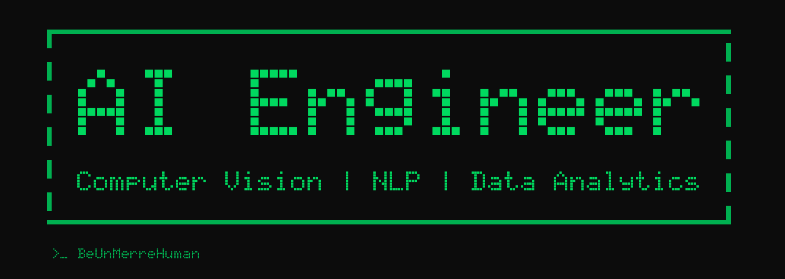

# Hi, I'm Muneeb Ur Rehman 👋

Artificial Intelligence Engineer drawn to projects that involve experimentation, research, and discovering new approaches to difficult problems. Whether it's Computer Vision, Data Science, or emerging developments in AI, I enjoy learning how ideas evolve and where the field is heading next. I'm passionate about building efficient AI systems that bridge research and real-world deployment.

---

## Currently Working On

🚁 **GNSS Spoofing Detection for UAVs**

Researching hybrid visual-GNSS navigation by integrating streaming 3D scene reconstruction, satellite-based localization, and knowledge-distilled vision models for real-time GNSS spoofing detection on edge UAVs.

---

## Featured Projects

- 🎯 Zero-Shot Anime Character Detection & Recognition
- 🤖 Retrieval-Augmented University Chatbot
- 🧠 Transformer Adaptation Benchmark (LoRA vs Full Fine-Tuning)
- 💬 LLM Style Transfer using QLoRA
- 📊 Large-Scale Data Analytics (40M+ records)

---

## Connect

